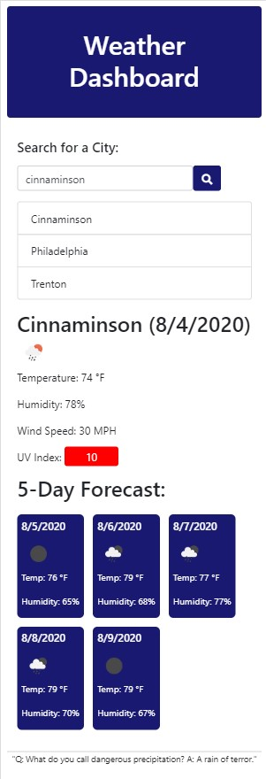
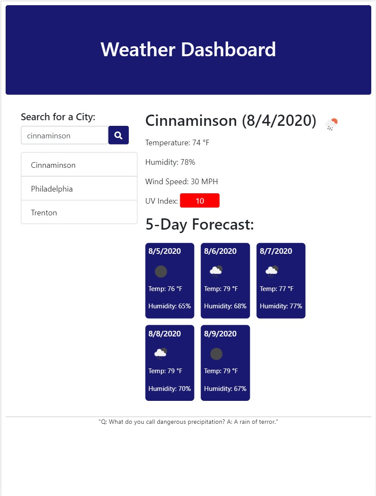
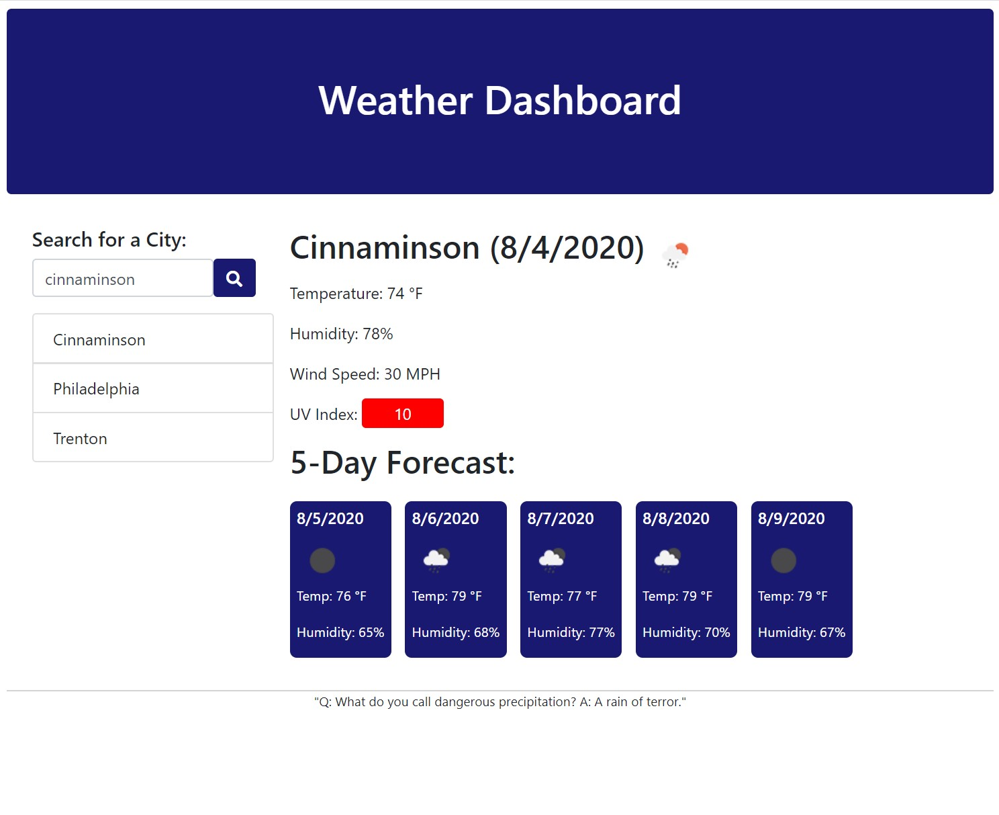

# Homework 06 - Weather App

This is Version 1.0 of an app that allows the user to search for the current and 5-day forecast weather by city name. It remembers cities that have been searched. The app uses HTML, CSS, jQuery, and moment.js. Weather information is from https://openweathermap.org/api. 

## Functionality

Enter the city name in the search field. When the search button is clicked, the current weather and 5-day forecast display on the page. In addition, the city name is added to a list of recent searches. The search list is retained after the browser is closed and reopened.

The current weather display includes the following: City name, date, a standard icon depicting the weather conditions, temperature, humidity, wind speed, and UV Index. Of note, the UV Index is color-coded with a color that corresponds to exposure category, as classified by the World Health Organization (WHO/ https://www.who.int/uv/publications/en/UVIGuide.pdf)

The application was developed to be mobile-responsive using "mobile-first" techniques.

## Development Roadmap
Future versions of the app will: remove duplication through code refactoring; limit the number of recent searches; prevent duplicate search terms from appearing in the recent search list; and add the State in whicn the city is located.

## Screenshots

